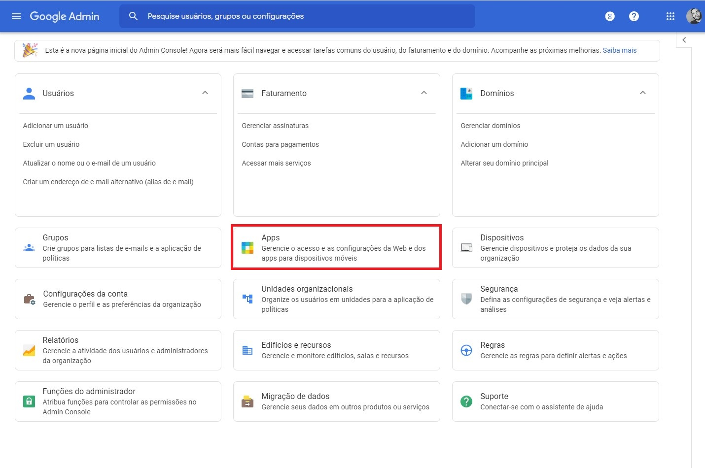
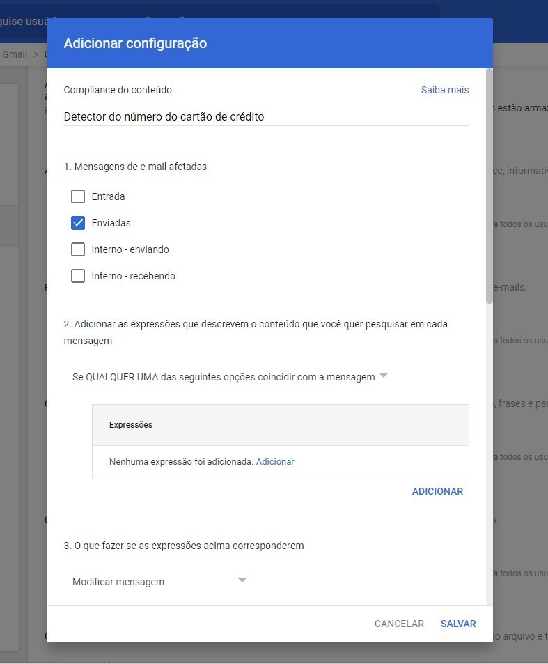

# Tutorial: Data Loss Prevention (DLP)

## Data Loss Prevention: o que é e como funciona
 

Data Loss Prevention (DLP), traduzido literalmente, significa “prevenção a perda de dados”. Esse tipo de soluções são utilizadas para o monitoramento de ocorrências que podem ocasionar o vazamento de informações. No geral, são focados na prevenção e correção de vulnerabilidades. Ouras soluções de segurança, como Firewalls, antivírus e antispams, podem ter um recurso de DLP – justamente por prevenirem o vazamento de dados.

Existem diferentes tipos de soluções DLP, mas todas com o mesmo objetivo: prevenir a perda de dados.

 

Neste tutorial vamos utilizar o Google Cloud para verificações de inspeção do seu conteúdo usando o recurso gatilho de jobs do Cloud Data Loss Prevention (DLP). 

### Verificar o tráfego de e-mails usando regras da DLP

A Prevenção contra perda de dados (DLP) do Gmail permite o uso de detectores de conteúdo predefinidos ao verificar e-mails de entrada ou saída. 

### Uma observação sobre a precisão

A correspondência de conteúdo predefinida não é 100% precisa porque nem todos os tipos de dados podem ser detectados com um alto grau de segurança.

A correspondência de conteúdo predefinida não garante compliance com os requisitos regulamentares. Como cliente, você pode definir os dados que são confidenciais e como eles devem ser protegidos. Teste suas configurações para verificar se elas atendem aos requisitos e use a quarentena para verificar as correspondências de conteúdo.
 

 

## Criando uma configuração de DLP no Google Cloud

No nosso exemplo vamos fazer uma verificação nos emails enviados com Número de Cartão de Crédito, e colocar uma camada de proteção.

1. [Faça o login](https://admin.google.com/) no Google Admin Console. 
  (Faça login usando uma conta de administrador)

 

2. Na página inicial do Admin Console, acesse **Apps** > **Google Workspace** > **Gmail** > **Compliance**.
* Console Google Admin

* Console Google Admin > Apps

* Console Google Admin > Apps > Google Workspace

* Console Google Admin > Apps > Google Workspace > Gmail

* Console Google Admin > Apps > Google Workspace > Gmail > Compliance

 

3. Selecione **Compliance do conteúdo**: 

 

4. Na parte superior, digite uma descrição curta, como **Detector do número do cartão de crédito**.

 

5. Na seção **Mensagens de e-mail afetadas**, selecione os tipos de mensagens que devem ser afetadas. 
Por exemplo, para limitar essa configuração apenas aos e-mails enviados, desmarque todas as caixas, exceto **Enviadas**.

 

6. Na seção **Expressões**, clique em **Adicionar**.  
Por exemplo, se você quiser verificar os e-mails enviados para identificar conteúdo que inclua informações de cartão de crédito, adicione **Número do cartão de crédito** e outras expressões que remetam a informação que queira identificar.

 

7. Na seção **O que fazer se as expressões acima corresponderem**, escolha se você quer modificar, rejeitar ou colocar a mensagem em quarentena. Para verificar as correspondências de conteúdo, use a quarentena. Neste caso vamos adicionar uma camada de criptografia na mensagem, selecionando a opção **transporte seguro (TLS)**.

 

8. Clique em **Salvar**.  

9. Todas as configurações adicionadas por você são destacadas na página **Configurações de e-mail**.  
10. Pode levar até 24 horas para que essa configuração entre em vigor.

